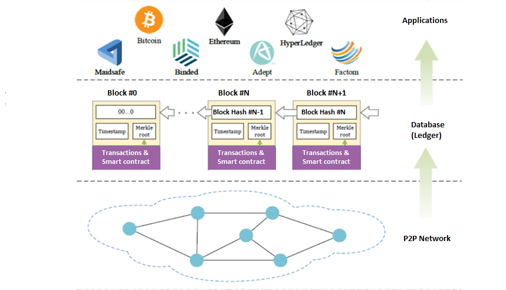
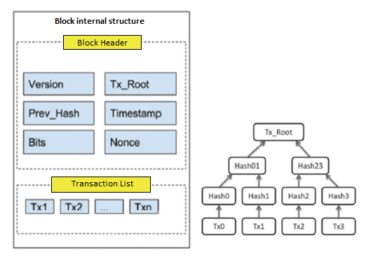
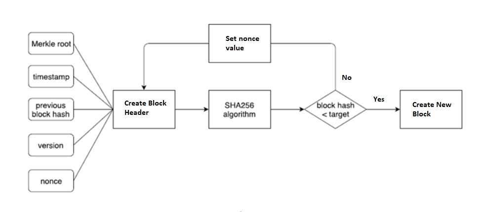

# 1-Overview
This tutorial tries to explain how to create a simple blockchain and also explains how bitcoin works.
## 2- Important areas of this training include the following
>	a. Hashing functions and how it works
>	b. Overview of a blockchain network structure
>	c. The internal structure of a block in a blockchain network
>	d. How the proof-of-work algorithm works

### 2-1-Hashing functions and how it works
The most important issue in creating a blockchain-based system is familiarity with how hashing functions work.
The function of the hash function is defined as converting a string of input data of any size into a string of specified length. The most important features of a hash function include the following :

>• **Deterministic:** The same input always yields the same hash.\
>• **Intractability:** It’s infeasible to find the input for a given hash except by exhaustion (trying a gargantuan amount of possible inputs).\
>• **Collision-safety:** It’s infeasible to find two different inputs which output the same hash.\
>• **Avalanche effect:** The smallest change in input should yield a hash so different that the new hash appears correlated with the old hash.\
>• **Speed:** It’s computationally fast to generate a hash.

Based on this, various scrambling algorithms have emerged, including
>1-**sha256:** Used in Bitcoin\
>2-**keccak256:** used in etherium\
>3-**md5**\
>4-**blake2b**\
> .....

In this tutorial, the sha256 function and how to use it in the program structure section will provide the necessary explanations

### 2-2-Overview of a blockchain network structure
The layering of blockchain network systems is as follows:\


In this structure, the entire chain of blocks is maintained by a network that is peer-to-peer.\
The upper layer is the applications that manage the maintenance of the blockchain (such as Etherium and Bitcoin) and the upper layer, which is not shown in this figure, is the distributed applications (DApp), which are based on this layer of business block management applications.\
Implement blockchain based.\
The internal structure of each block can be shown as follows



Inside each block in the form of a program structure can be displayed as follows:

block_1038 = { 
>'index': 1038, 
>'timestamp': "2020-02-25T08:07:42.170675",
>'Tx_Root': "83b2ac5b",
>‘nonce’: “123456",
>'previous_hash': "2cf24ba5f“,
>>'data’: [
>>>{\
>>>'sender’: “Ali",\ 
>>>'recipient’: “hasan",\ 
>>>'amount': "$5”\
>>>}
>>]
}

Items in this structure include
> **• Index:** shows the block number\
> **• Timestamp:** Date and time of transaction\
> **• Tx_Root:** ‌ Hash is equivalent to the transactions that are shown in Figure 2\
> **• Nonce:** is a specific value that is used in the PoW mechanism and will be explained below.\
> **• Data:** that is a list of transactions in which the information of sender, recipient and amount sent is specified in the form of Array

### 2-2-How the proof-of-work algorithm works
In proof-of-work algorithms, which have been introduced through Etherium and bitcoin cryptocurrencies and are now widely used, the block generating member in each round is selected through a computational competition. This computational competition is encrypted by solving a computational puzzle, and any member who solves it sooner than the others will have the authority to add the block to the chain. Members who participate in this activity are called miners or explorers, and if the explorer can add a new block to the chain by solving this puzzle, he will receive a certain amount of reward.\
The following figure shows the operation of the proof-of-work algorithm in more detail


If the miner can find the right amount of nonce, it will send the block along with the amount of nonce obtained to others to inform them that the computational puzzle has been solved. 
When the explorers receive this message, they stop their calculations on the block in question and validate the new block and the transactions in it.
If the block is validated, they add it to their local version of the blockchain, otherwise they continue the computational process of solving the puzzle.

## 3- The overall structure of the program
The feature of the implemented training program is that it is implemented based on Spring Boot. For ease of use, it is possible to call services both as a command line and Rest service call.
Each node can act as both a miner and a transaction recorder.

###3-1-Installing and Running

To run the sample install Java 1.8+, Maven for your OS and download the code. 
Edit the application.properties file to set port number in server.port.
And simply run this command in the source root

```
mvn springboot:run 
or in command line type
java -jar tosancoin-0.0.1-SNAPSHOT.jar --server.port=8050 
```
then appears on the command line shell:> prompt

### 3-2- Service list
> **1-transaction:** To record a transfer transaction from a source to a destination in mem-pool\
> for example to send  10$ from shahram to hassan can use :
> ```
>  shell:>transaction -S shahram -R hassan -A 10 
> ```
> **2-mine:**  This command used to build the block from mem-pool transactions and clear mem-pool after mining . This service call does not require an input parameter
> ```
>  shell:> mine 
> ```
> **3-chain:** Used to display the chain of blocks made so far and has no input parameters.
> ```
>  shell:> chain 
> ```
> **4-node:** for adding a peer to connect this node (You can run several nodes on different ports and create a peer-to-peer network by connecting these nodes.) \
> for example
> ```
>  shell:>node -N "http://localhost:8050" 
> ```
> **5-resolve:** This command is used to send the block chain created by this node to other connected nodes. Each node receives a block chain to check whether the transmitted chain is valid or not. \
    If the chain is valid and the length of this chain is longer than the local chain, this block chain will be replaced with the local block chain. This service is called without any argument\
> ```
>  shell:> resolve
> ```
> **6-links:** Shows the list of nodes connected to this node.This service is called without any argument
> ```
>  shell:> links
> ```
